# NexeumVs - System Architecture & Technical Design

## 🏛️ High-Level System Architecture

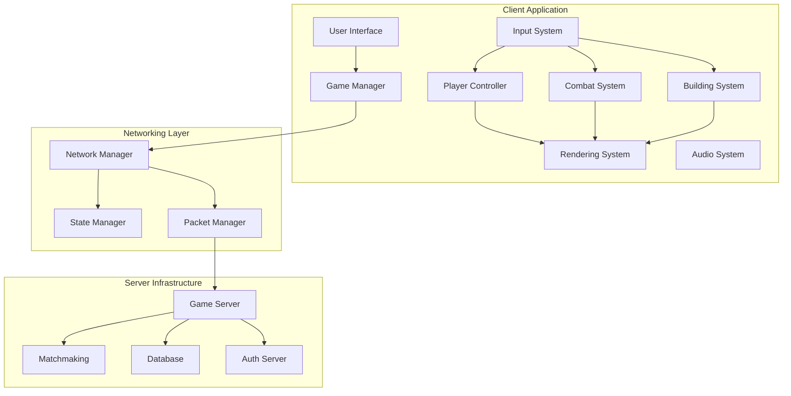

## 🎮 Core Game Systems Architecture

### Player Controller System
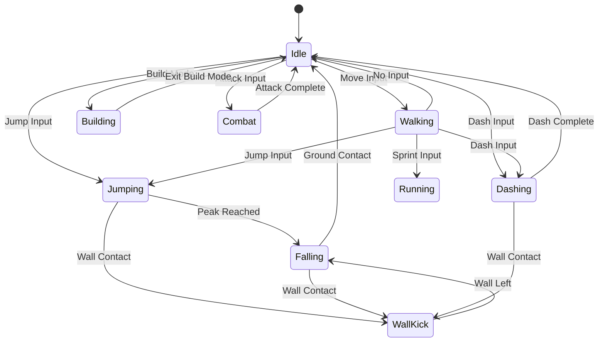

### Combat System Flow
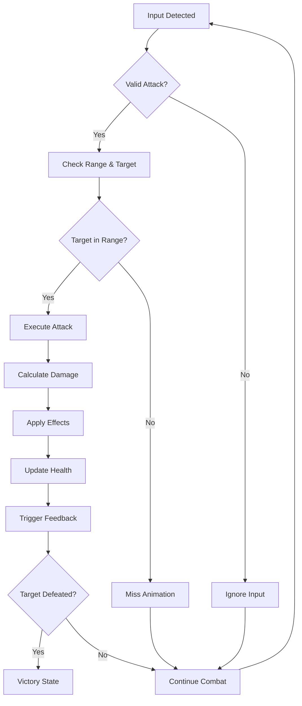

### Building System Architecture
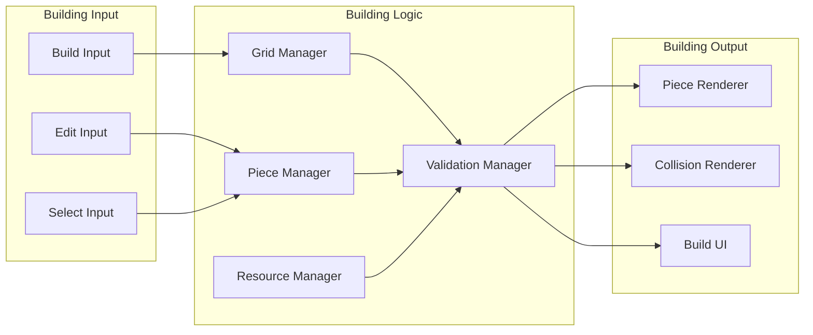

## 🌐 Multiplayer Network Architecture

### Client-Server Communication
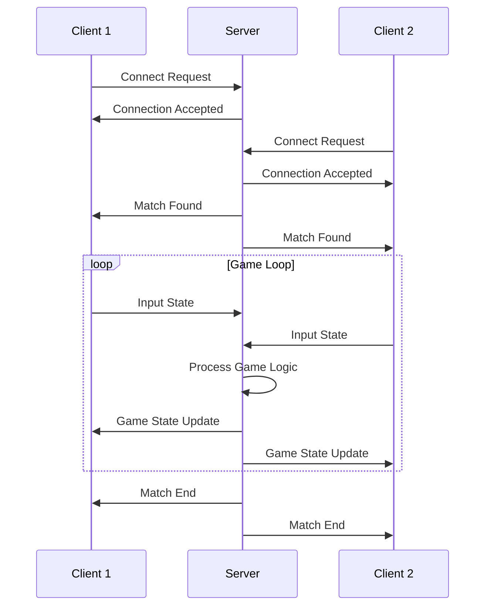

### State Synchronization Strategy
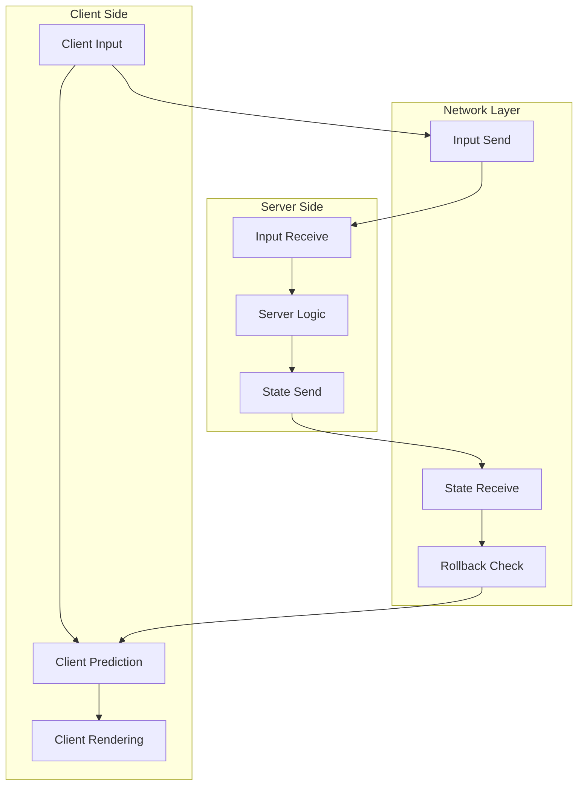

## 🏗️ Building System Technical Design

### Grid-Based Building System
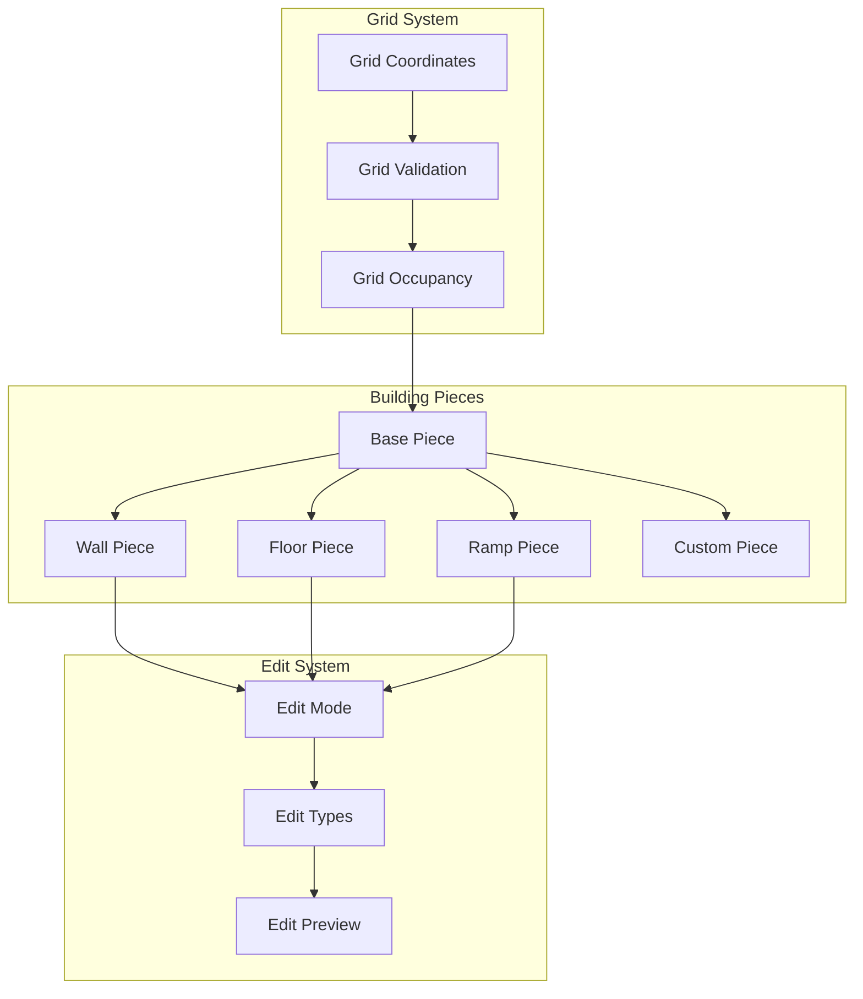

### Building Piece Hierarchy
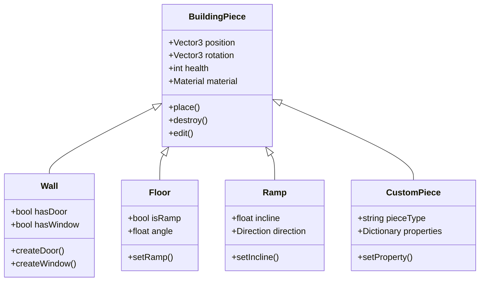

## ⚔️ Combat System Technical Design

### Damage Calculation System
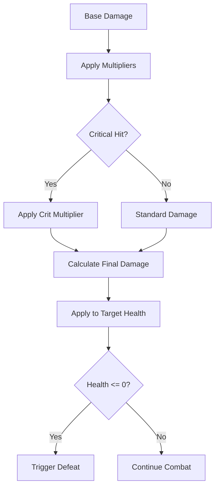

### Hit Detection System
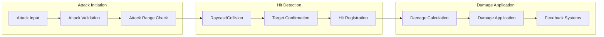

## 🎨 Rendering & Performance Architecture

### Rendering Pipeline
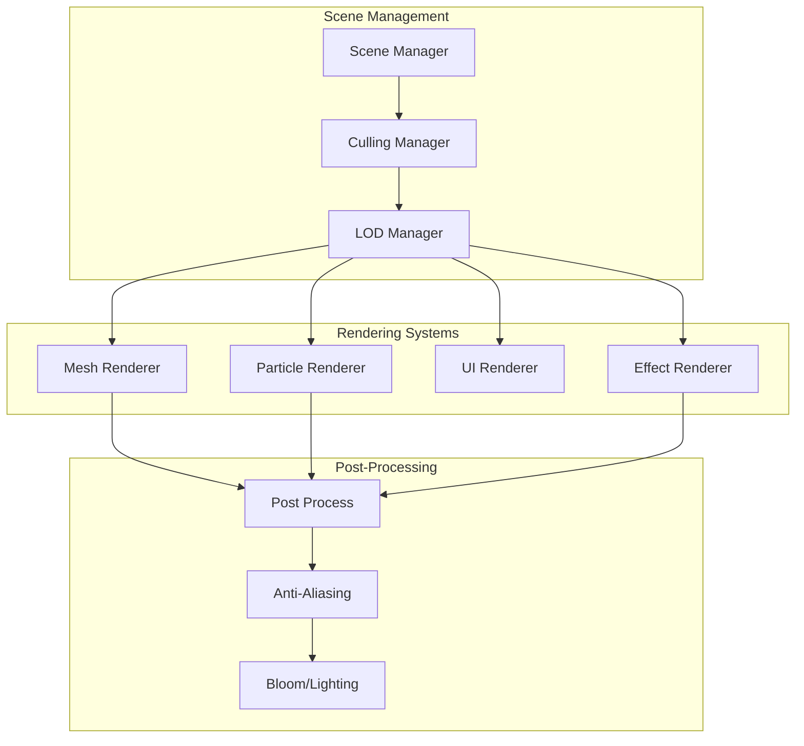

### Performance Optimization Strategy
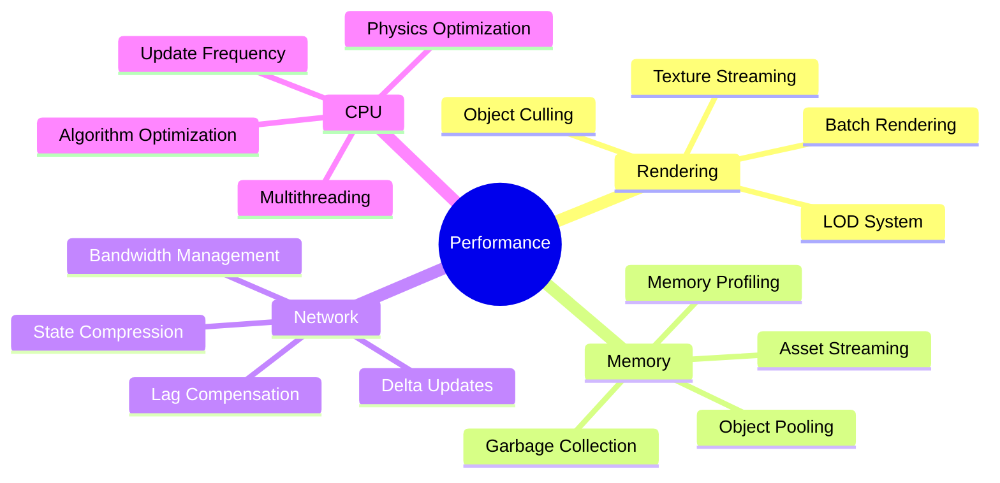

## 🔧 Development Tools & Workflow

### Asset Pipeline
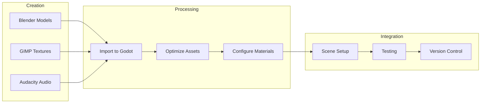

### Development Workflow
```mermaid
gitgraph
    commit id: "Initial Setup"
    branch feature-movement
    checkout feature-movement
    commit id: "Basic Movement"
    commit id: "Advanced Movement"
    checkout main
    merge feature-movement
    
    branch feature-combat
    checkout feature-combat
    commit id: "Hit Detection"
    commit id: "Damage System"
    checkout main
    merge feature-combat
    
    branch feature-building
    checkout feature-building
    commit id: "Grid System"
    commit id: "Building Pieces"
    checkout main
    merge feature-building
    
    commit id: "Integration Testing"
    commit id: "Performance Optimization"
```

## 📊 Data Management Architecture

### Game Data Structure
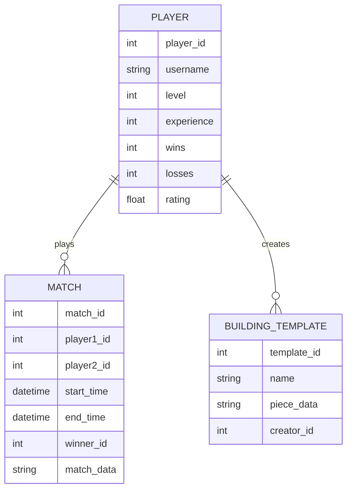

### Configuration Management
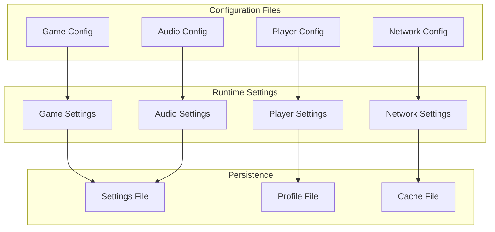

This technical architecture provides the foundation for building NexeumVs with scalable, maintainable systems that can grow with the project's complexity.